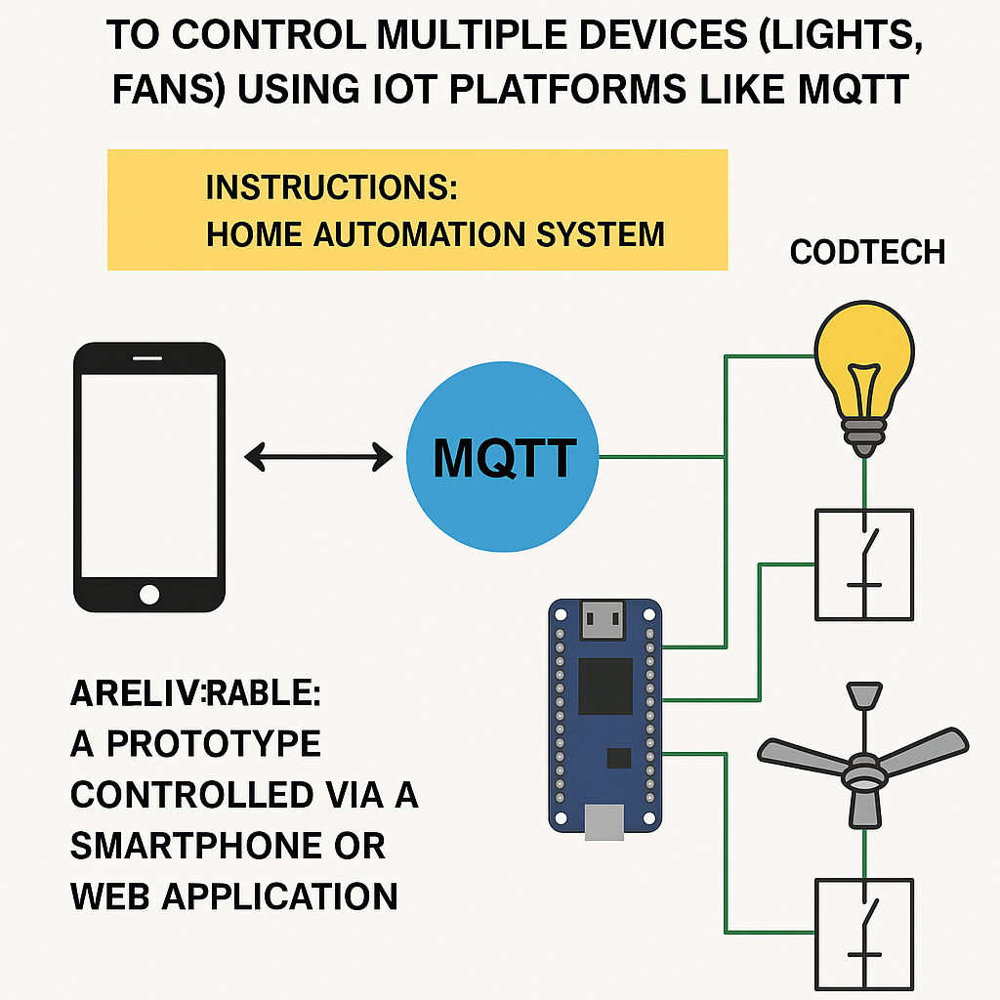

<<<<<<< HEAD
<<<<<<< HEAD
<<<<<<< HEAD
# Task 1 – Smart Light Control

## Overview
Control an LED using Bluetooth module (HC-05) and Arduino UNO, via a mobile app.

## Hardware Used
- Arduino UNO
- HC-05 Bluetooth Module
- LED + Resistor
- Breadboard, Jumper wires
- Android Phone

## How It Works
- Mobile app sends '1' or '0' via Bluetooth
- HC-05 receives and forwards to Arduino
- Arduino turns LED ON/OFF

## Demo App
Used: **Bluetooth Terminal App** (Play Store)

## Circuit

## Code
See `smart_light.ino` file.
=======
# Task 2 – Home Automation using MQTT

## Objective
Control multiple devices (Light and Fan represented by LEDs) using NodeMCU and MQTT protocol.

## Components Used
- NodeMCU ESP8266
- 2x LEDs
- 2x 220 Ohm Resistors
- Breadboard and jumper wires
- MQTT Broker: broker.hivemq.com
- MQTT Dashboard App (Android) or HiveMQ Web Client

## MQTT Topics
- `iot/light` → controls Light LED
- `iot/fan` → controls Fan LED
- Message should be either "on" or "off"

## How to Use
1. Upload the `mqtt_home_automation.ino` code to NodeMCU using Arduino IDE.
2. Open MQTT Dashboard app and connect to broker.hivemq.com
3. Publish messages to topics:
   - `iot/light` → "on" / "off"
   - `iot/fan` → "on" / "off"

## Folder Contents
- mqtt_home_automation.ino – Arduino code
- README.md – documentation
- Add your screenshots and circuit diagram here

## Circuit

## Output
LED1 (Light) and LED2 (Fan) will turn ON or OFF based on MQTT messages.
>>>>>>> 8dc2dd6 (Initial commit)
=======
# Task 3 - IoT Security System - Motion Detection & Image Capture with Telegram Alerts

## Project Overview
This IoT-based security system uses the ESP32-CAM to detect motion using a PIR sensor, capture images when motion is detected, and send an alert via Telegram to a mobile device.

## Requirements
* ESP32-CAM Module
* PIR Motion Sensor
* Wi-Fi Network
* Telegram Bot (with Bot Token and Chat ID)
* Arduino IDE (with ESP32 board support installed)

## Setup Instructions
1. Create a Telegram bot and get the bot token and chat ID.
2. Set up the ESP32-CAM module and PIR motion sensor.
3. Configure the code with your Wi-Fi credentials, bot token, and chat ID.
4. Upload the code to the ESP32-CAM module.
5. Use the Telegram app to receive messages from your bot.

## Circuit Diagram

Or, you can create your own circuit diagram using the following connections:

* PIR Motion Sensor: VCC to ESP32-CAM 5V, GND to ESP32-CAM GND, OUT to ESP32-CAM GPIO 13
* ESP32-CAM: Connect to Wi-Fi network using Wi-Fi credentials

## Troubleshooting
* If the camera isn’t initializing, ensure that you’ve selected the correct board (ESP32-CAM) in the Arduino IDE.
* Ensure that the PIR sensor is wired properly and powered correctly.

## License
This project is open source and available under the MIT License.

## Troubleshooting
- If the camera isn’t initializing, ensure that you’ve selected the correct board (ESP32-CAM) in the Arduino IDE.
- Ensure that the PIR sensor is wired properly and powered correctly.

>>>>>>> cca55b3 (Task3 commit)
=======
# Task 4 – IoT Air Quality Monitoring System

## Objective
Monitor air quality using the MQ135 gas sensor and display real-time values on a ThingSpeak cloud dashboard.

## Components Used
- NodeMCU (ESP8266)
- MQ135 Air Quality Sensor
- Wi-Fi (mobile hotspot: vivo Y56 5G)
- ThingSpeak account

## Working
- The MQ135 sensor reads analog air quality voltage.
- NodeMCU sends this data to ThingSpeak every 15 seconds.
- Data is visualized in a live chart on the ThingSpeak dashboard.

## ThingSpeak Info
- Channel ID: 2954132
- Write API Key: TCYTF64UHKLZ5QI2

## Connection Diagram
- MQ135 VCC → NodeMCU 3.3V
- MQ135 GND → NodeMCU GND
- MQ135 AOUT → NodeMCU A0
>>>>>>> 2fe75aa (Task4 commit)
