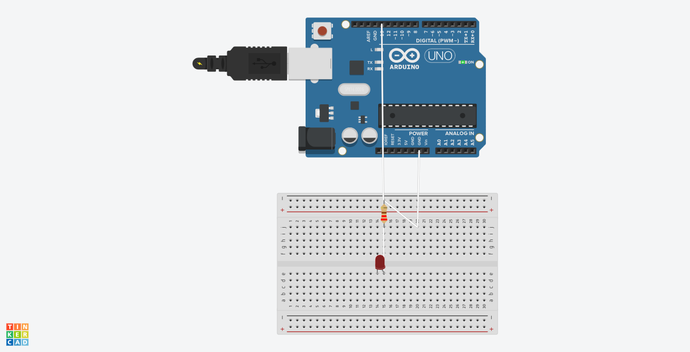

# Task 1 – Smart Light Control

## Overview
Control an LED using Bluetooth module (HC-05) and Arduino UNO, via a mobile app.

## Hardware Used
- Arduino UNO
- HC-05 Bluetooth Module
- LED + Resistor
- Breadboard, Jumper wires
- Android Phone

## How It Works
- Mobile app sends '1' or '0' via Bluetooth
- HC-05 receives and forwards to Arduino
- Arduino turns LED ON/OFF

## Demo App
Used: **Bluetooth Terminal App** (Play Store)

## Circuit

## Code
See `smart_light.ino` file.
